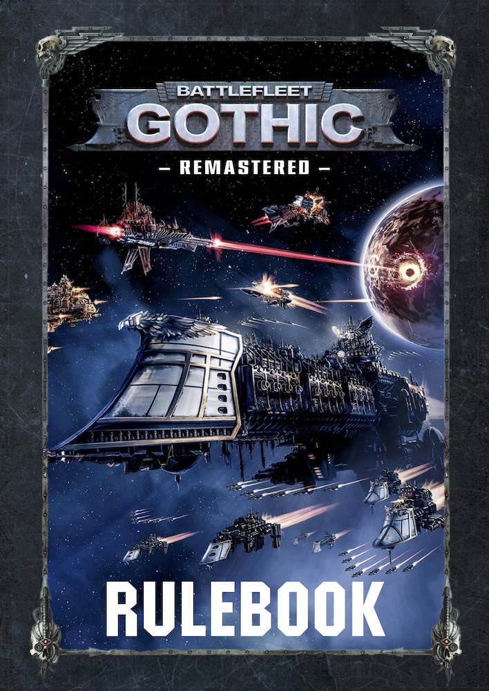
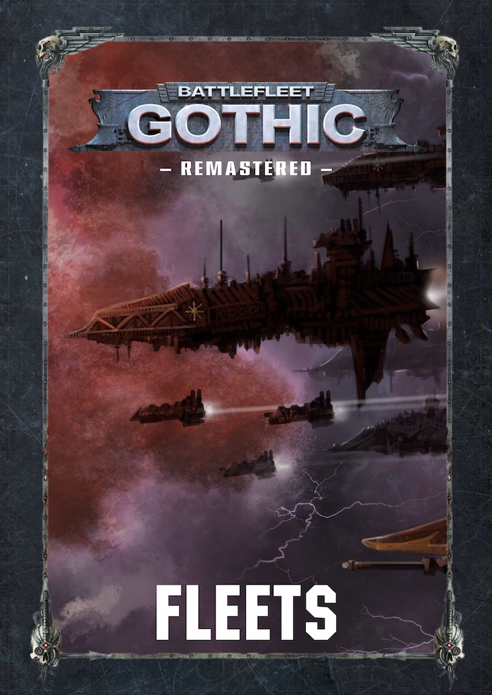

---
hide:
    - path
    - navigation
    - toc
---
# Home

- <figure><figcaption>[The Rulebook](the-rules.md) (v1.11)</figcaption></figure>
- <figure><figcaption>[Fleet Lists](fleet-lists/index.md) (v0.36)</figcaption></figure>

[Acknowledgements](acknowledgements.md)&nbsp;&middot;&nbsp;[Colophon](colophon.md)

